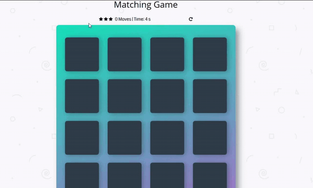

Udacity Front-End Web Developer Nanodegree Project : Memory Game

## Instructions

The starter project has some HTML and CSS styling to display a static version of the Memory Game project. You'll need to convert this project from a static project to an interactive one. This will require modifying the HTML and CSS files, but primarily the JavaScript file.

To get started, open `js/app.js` and start building out the app's functionality

For specific, detailed instructions, have a look at the project instructions in the [Udacity Classroom](https://classroom.udacity.com/me).

## How to Play:

* The goal is to match all the cards together and win the game.

1. Open the index.html . Then the game can be started by clicking on two cards, if they match, then look for another pair of cards or else try again as cards are arranged randomly on the grid with the symbol face down.

2. The star rating depends on the number of moves. The game ends once all cards have been correctly matched. The player could restart the game at any time by clicking on the restart icon. 

3. Congratulations, you win! An alert window appears tell you your score, time, and moves it took to complete the game. If there is an issue 	with a single card randomly paired, just hit the restart button on the top right corner of the game. 

4. On the Alert window, you can hit 'Go Again!' to play the game again, keep playing till you get the best score.

5. The project was developed using HTML, CSS, JS.

## Tools Used: 

* Getting started Udacity excersize: 
  * https://github.com/udacity/fend-project-memory-game

## Known Issues:

* Matching  cards too quickly together, can get a single card may be mathced. 

## Contributing

This repository is the starter code for _all_ Udacity students. Therefore, we most likely will not accept pull requests.

For details, check out [CONTRIBUTING.md](CONTRIBUTING.md).
